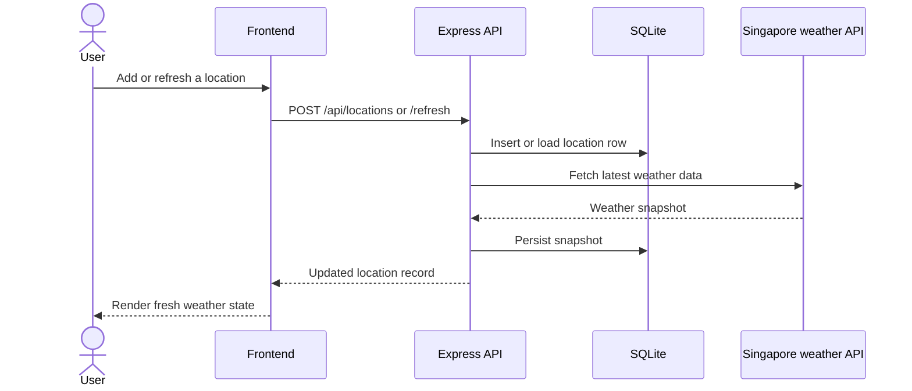

Weather Starter uses a small number of well-defined layers:

- A browser UI built with React.
- An Express server that handles every `/api/*` request.
- SQLite for persisted locations and snapshot data.
- The Singapore weather API as the upstream data source.

## Request path



## System boundaries

```mermaid
flowchart TB
  subgraph Browser
    UI[React app]
    Store[State store]
    Components[Dashboard components]
    UI --> Store
    Store --> Components
  end

  subgraph Server
    Server[Express app]
    Routes[Locations router]
    DB[SQLite helpers]
    Weather[SingaporeWeatherClient]
    Server --> Routes
    Routes --> DB
    Routes --> Weather
  end

  Browser <-->|/api/*| Server
  DB --> SQLite[(weather.db)]
```

## Design notes

- The browser never talks to the weather provider directly.
- The server refreshes weather during create and refresh operations so the UI always receives a snapshot record.
- The SQLite row shape mirrors the weather snapshot, which keeps the read path simple for the frontend.
- Logging is split between request logs, application logs, and frontend interaction events sent to `/api/logs`.
