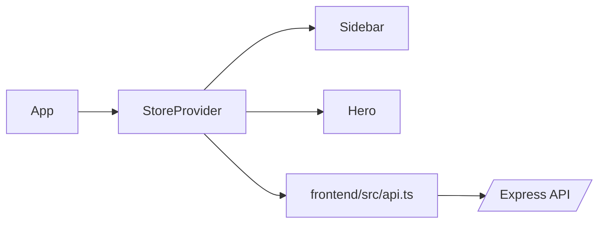

The frontend is a React 18 single-page app that reads and writes through `/api/*` only.

## Top-level structure

[`frontend/src/App.tsx`](/Users/gerard/Projects/weather_starter/frontend/src/App.tsx) wraps the UI in:

- `ThemeProvider`
- `StoreProvider`
- `Layout`

[`frontend/src/components/Layout.tsx`](/Users/gerard/Projects/weather_starter/frontend/src/components/Layout.tsx) composes the main dashboard shell from:

- `ThemeSelector`
- `Sidebar`
- `Hero`

## State orchestration

[`frontend/src/state/store.tsx`](/Users/gerard/Projects/weather_starter/frontend/src/state/store.tsx) is the client state hub.

- It loads locations on mount.
- It tracks the selected location, add mode, refresh state, and errors.
- It coordinates create, refresh, and delete operations.
- It emits interaction events through `logInteraction`.

## Sidebar

[`frontend/src/components/Sidebar.tsx`](/Users/gerard/Projects/weather_starter/frontend/src/components/Sidebar.tsx) handles:

- Searching saved locations by area or current condition
- Opening the add-location form
- Rendering the saved-location cards

[`frontend/src/components/AddLocationForm.tsx`](/Users/gerard/Projects/weather_starter/frontend/src/components/AddLocationForm.tsx) validates and submits Singapore coordinates.

[`frontend/src/components/SidebarCard.tsx`](/Users/gerard/Projects/weather_starter/frontend/src/components/SidebarCard.tsx) shows each saved location with temperature, conditions, high/low, humidity, and rainfall.

## Main panel

[`frontend/src/components/Hero.tsx`](/Users/gerard/Projects/weather_starter/frontend/src/components/Hero.tsx) renders the selected location details:

- Current temperature, condition, and time updated
- Hourly forecast strip
- 10-day forecast
- Map card
- Metric tiles
- Refresh action

### Supporting cards

- [`frontend/src/components/HourlyStrip.tsx`](/Users/gerard/Projects/weather_starter/frontend/src/components/HourlyStrip.tsx)
- [`frontend/src/components/TenDayForecast.tsx`](/Users/gerard/Projects/weather_starter/frontend/src/components/TenDayForecast.tsx)
- [`frontend/src/components/WeatherMapCard.tsx`](/Users/gerard/Projects/weather_starter/frontend/src/components/WeatherMapCard.tsx)
- [`frontend/src/components/Tiles.tsx`](/Users/gerard/Projects/weather_starter/frontend/src/components/Tiles.tsx)

## Theming

[`frontend/src/theme.tsx`](/Users/gerard/Projects/weather_starter/frontend/src/theme.tsx) and [`frontend/src/components/ThemeSelector.tsx`](/Users/gerard/Projects/weather_starter/frontend/src/components/ThemeSelector.tsx) manage the UI theme switcher.

The theme selector is fixed in the top-right corner and updates the document theme without affecting the location store.
