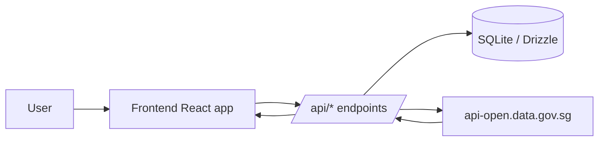

Weather Starter is a split full-stack starter for Singapore weather data.

The frontend renders a location-based weather dashboard, while the backend owns API access, validation, persistence, and logging. The two halves communicate through `/api/*` routes, which keeps the browser client simple and lets the server own the external weather calls.

## What lives where

- `frontend/` is the React 18 + Vite app.
- `backend/` is the Express + TypeScript API.
- `scripts/` contains the shared dev, start, reset, and health-check helpers.
- The docs site lives at the repository root in `src/content/docs/`.

## Core flow

## Main responsibilities

- The frontend loads locations, manages selection state, and sends create, refresh, and delete requests.
- The backend validates coordinates, stores locations, and refreshes snapshots from Singapore weather endpoints.
- SQLite stores each location and its latest snapshot in the `locations` table.

## Key files

- [`backend/src/server.ts`](/Users/gerard/Projects/weather_starter/backend/src/server.ts)
- [`backend/src/routes/locations.ts`](/Users/gerard/Projects/weather_starter/backend/src/routes/locations.ts)
- [`backend/src/db.ts`](/Users/gerard/Projects/weather_starter/backend/src/db.ts)
- [`frontend/src/state/store.tsx`](/Users/gerard/Projects/weather_starter/frontend/src/state/store.tsx)
- [`frontend/src/api.ts`](/Users/gerard/Projects/weather_starter/frontend/src/api.ts)
- [`frontend/src/components/Layout.tsx`](/Users/gerard/Projects/weather_starter/frontend/src/components/Layout.tsx)
